# **BDR TP2**

## **Exercice 1**

### **Question 1.1**

La colonne fac_num est la clé primaire de la table facture et de ce fait, cette table est indexée par rapport à cette colonne.

L'index créé à partir de fac_num est de type btree comme on peut voir dans sa définition ci-dessous.

```sql
CREATE UNIQUE INDEX facture_pkey ON facture USING btree (fac_num)
```

### **Question 1.2**

```sql
EXPLAIN ANALYZE SELECT fac_num, fac_date, fac_montant FROM facture WHERE fac_num=500
```

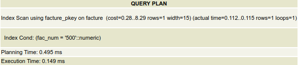

L'index facture_pkey est bien utilisé.

### **Question 1.3**

```sql
EXPLAIN ANALYZE SELECT fac_num, fac_date, fac_montant FROM facture WHERE floor(fac_num/100)=5
```


L'index facture_pkey n'est cette fois pas utilisé.

Car le résultat ne dépend pas directement de celui-ci.

Une requête alternative utilisant l'index serait :

```sql
EXPLAIN ANALYZE SELECT fac_num, fac_date, fac_montant FROM facture WHERE fac_num>=500 AND fac_num<600
```

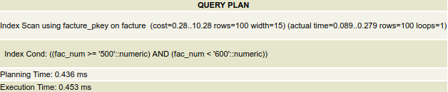

### **Question 1.4**

```sql
EXPLAIN ANALYZE SELECT fac_num, fac_date, fac_montant FROM facture WHERE fac_num>=500 AND fac_num<550 AND fac_date>=TO_DATE('2017-01-06','%Y %d %m') AND fac_date<TO_DATE('2017-31-08','%Y %d %m')
```

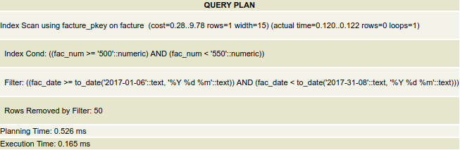

L'index est d'abord utilisé pour filtrer avant que le résultat de ce filtrage soit filtré avec les autres conditions de la commande.

___

## **Exercice 2**

### **Question 2.1**

```sql
CREATE INDEX facture_num_100 ON facture USING btree(floor(fac_num/100))
```

La sélectivité de cet index est 100 / n au maximum, n étant le nombre d'entrées de la table.

### **Question 2.2**

Sans index créé :

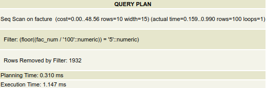

Avec index créé :

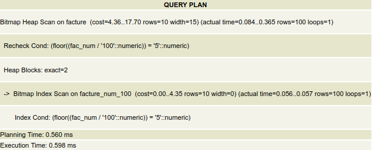

Avec range query :

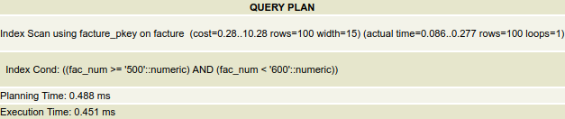

La requête sans index créé est la plus lente des trois.  
La requête avec l'index créé est la seconde plus rapide.  
La requête avec range query est la plus rapide des trois.

### **Question 2.3**

```sql
CREATE INDEX facture_date ON facture USING btree(fac_date)
```

### **Question 2.4**

```sql
CREATE INDEX facture_annee_mois ON facture USING btree(to_char(fac_date,'YYYY mm'))
```

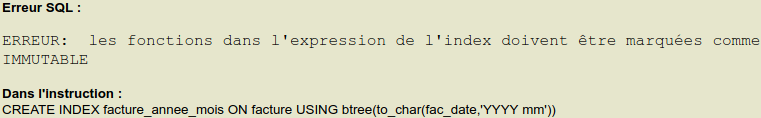

### **Question 2.5**

```sql
SELECT fac_num, fac_date, fac_montant FROM facture WHERE fac_date BETWEEN '2017-01-01' AND '2017-01-31'
```

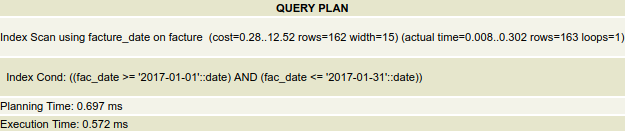

___

## **Exercice 3**

### **Question 3.1**

```sql
EXPLAIN ANALYZE SELECT * FROM ligne_facture WHERE lig_facture=250 AND lig_facture=44
```

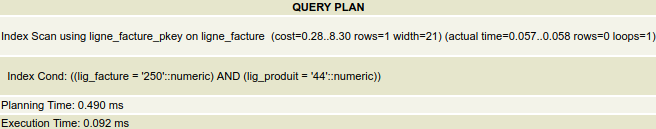

```sql
EXPLAIN ANALYZE SELECT * FROM ligne_facture WHERE lig_facture BETWEEN 1000 AND 1005
```

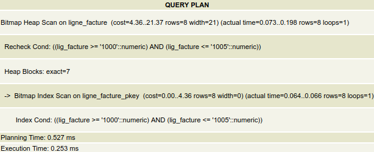

```sql
EXPLAIN ANALYZE SELECT * FROM ligne_facture WHERE lig_produit=44
```

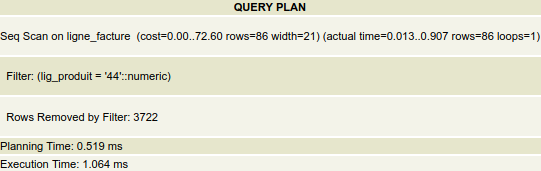

Pour la première requête :  
Le premier élément de l'index est d'abord analysé et c'est que si celui-ci rempli les conditions que le second élément est ensuite analysée.

Pour la deuxième requête :  
L'index est utilisé lors de la seconde vérification.

Pour la troisième requête :  
L'index n'est pas utilisé car l'élément servant de condition n'est pas le premier mais le second. Un scan séquentiel est utilisé à la place.

### **Question 3.2**

Avoir un seul index permet une rapidité accrue de recherche.

Avoir deux indexs permet une meilleure flexibilité de recherche.

___

## **Exercice 4**

### **Question 4.1**

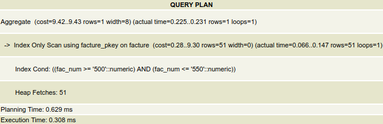

Une aggrégation des données est faite avant la recherche.

### **Question 4.2**

```sql
SELECT * FROM album WHERE al_id=20
```

L'index sur la clé primaire n'est pas utilisé car la condition s'agissant de la clé primaire, toutes les lignes de cette colonne sont uniques et il est au pire aussi rapide de chercher en utilisant l'index que sans.

### **Question 4.3**

```sql
EXPLAIN ANALYZE SELECT lig_facture, SUM(lig_quantite) AS nb_produits, COUNT(*) AS nb_produits_distincts FROM ligne_facture GROUP BY lig_facture
```

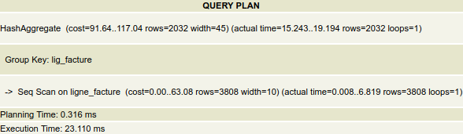

```sql
EXPLAIN ANALYZE SELECT lig_facture, SUM(lig_quantite) AS nb_produits, COUNT(*) AS nb_produits_distincts FROM ligne_facture WHERE lig_facture>=500 AND lig_facture<550 GROUP BY lig_facture
```

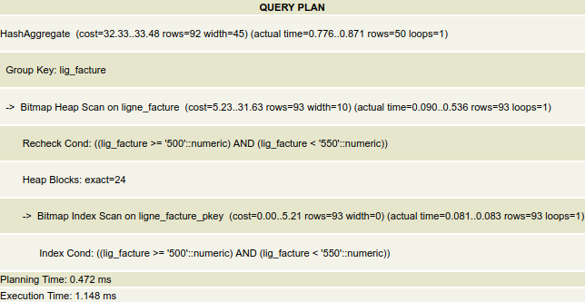

```sql
EXPLAIN ANALYZE SELECT lig_facture, SUM(lig_quantite) AS nb_produits, COUNT(*) AS nb_produits_distincts FROM ligne_facture WHERE lig_facture>=200 AND lig_facture<1000 GROUP BY lig_facture
```

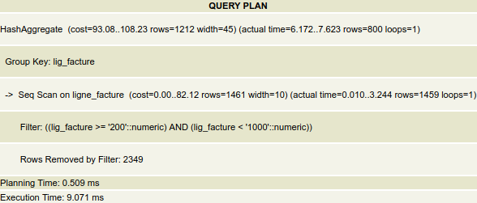

Cela aurait à voir avec le nombre de lignes à analyser ou bien la différence de la tranche par rapport au min-max de la colonne lig_facture.

___

## **Exercice 5**

### **Question 5.1**

```sql
EXPLAIN ANALYZE SELECT lig_facture, lig_produit, lig_quantite FROM ligne_facture WHERE lig_quantite>1
```

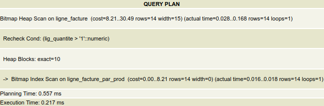

```sql
EXPLAIN ANALYZE SELECT lig_facture, lig_produit, lig_quantite FROM ligne_facture WHERE lig_quantite>2
```

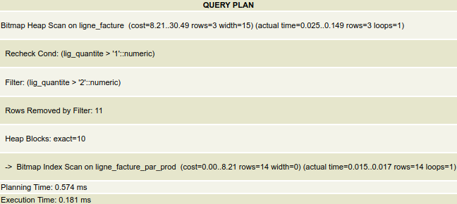

L'index ligne_facture_par_prod est utilisé dans les deux requêtes.

### **Question 5.2**

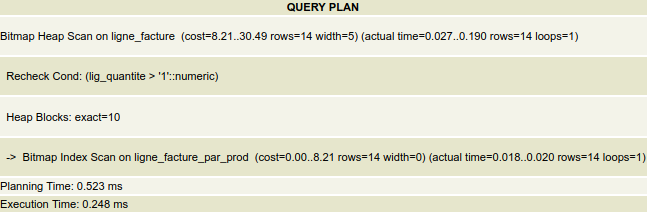

La condition du WHERE est checkée avant le d'indexs bitmap.

___

## **Exercice 6**

### **Question 6.1**

Avant :

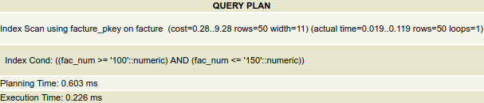

Après :

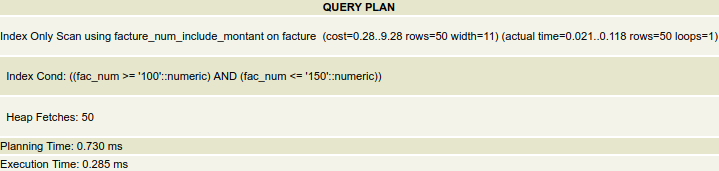

Le nouvel index est préféré à l'ancien. Il est sûrement plus adapté à la requête que l'ancien index.
