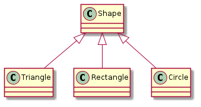
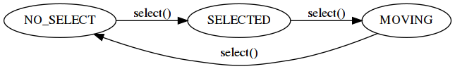

# Introduction

Binome : DENDONCKER Florian / HAMANI Rayane

Vous devez écrire un programme pour créer, dessiner et manipuler des
formes géométriques sur l'écran. Une partie du programme est déjà
disponible dans le code source.

Le but de ce TP est de: 

1.  S'entraîner avec le concept d'héritage public, et avec la
    librairie standard pour le vecteurs
2.  Utiliser une bibliothèque C++ existante pour dessiner des formes.

Commençons par lire et comprendre le code existant.


## Compilation

Le programme utilise `cmake`. Suivez les instructions du TP 1 pour
compiler et exécuter les programmes. Le dépôt contient deux programmes: 

-   `exemple_main` : un exemple d'utilisation de la bibliothèque `CImg`
-   `shape_main` : le programme à modifier.


## La bibliothéque CImg

Pour visualiser les formes, on utilise la librairie *CImg*
<http://cimg.eu/>. La librairie est composée d'un seul fichier `CImg.h`
qu'il faut inclure dans notre programme. Un exemple de programme est
fourni dans le fichier `src/main.cpp`, qui génère l'exécutable
`exemple_main`.

La librairie permet ainsi de recevoir des commandes par la souris et
par le clavier : la méthode `main_disp.wait();` attend un *évènement*,
c'est à dire un mouvement de la souris, un clic du bouton de la
souris, ou la pression d'une touche. On peut ensuite examiner de quel
évènement s'agit avec des méthodes comme
`main_disp.is_key(cimg::keyA);`, ou `main_disp.button()`, ou encore
`main_disp.mouse_x()` et `main_disp.mouse_y()`.

La documentation de la librairie est fournie dans
`CImg/CImg_reference.pdf`.


# Les formes

Le programme `src/shape_main.cpp` permet de créer, sélectionner et
déplacer des formes géométriques dans la fenêtre du programme.

Voici le diagramme de la hiérarchie de classes:



Les formes ont une position `(x, y)` sur le plan 2D. Elles peuvent
être déplacées (changer la position) avec la fonction `move()` et ils
peuvent être dessinées avec la fonction `draw()`.

La fonction `is_inside(int x, int y)` retourne **true** si le point
`(x,y)` est à l'intérieur de la forme, et il est utilisé pour
sélectionner une forme avec la souris.

La fonction `select()` est utilisé pour sélectionner une forme. Une
forme est initialement non sélectionnée (état `NO_SELECT`). Si on
appelle la fonction `select()`, la forme passe à travers les état
`SELECTED` et `MOVING` et après elle revient à l'état `NO_SELECT`. Le
diagramme d'état est montré ci-dessous :




# Collectionner les formes

Toutes les formes crées par l'utilisateur sont mémorisées dans des `vector`:

```c++
    vector<Shape *> all_shapes;     // the vector containing all shapes
    vector<Shape *> sel_shapes;     // the vector containing only selected shapes
    Shape *moving = nullptr;        // the shape to be moved
```

Pour dessiner toutes les formes, il faut juste appeler leur fonction `draw()` :

```c++
    for (Shape *p : all_shapes) p->draw();
```

Le vecteur `sel_shapes` contient les pointeurs au formes qui ont étés
sélectionnées avec un click du mouse. Le pointeur `moving` point vers
une forme qui a reçue deux click, et qui est dans l'état `MOVING`.

Tous les pointeurs aux formes se trouvent dans `all_shapes`, donc
`sel_shapes` est un sous-ensemble de `all_shapes`. Le pointeur
`moving` ne se trouve jamais dans `sel_shapes`. 


## Question 1

Expliquez pourquoi les fonctions `Shape::draw()` et
`Shape::is_inside()` sont virtuelles, et pourquoi le fonctions
`Shape::move()` et `Shape::select()` ne les sont pas ?


### Reponse

```Shape::draw()``` et ```Shape::is_inside``` sont  virtuelle car leur fonctionnement change en fonction de la forme sur laquelle ils s'appliquent.

Ce n'est pas le cas des fonctions ```Shape::move()``` et ```Shape::select()```, qui elles fonctionnent de la meme maniere peut importe la forme choisie.


# Effacer des formes

Pour créer une forme, il faut :

-   appuyer sur la touche 't' pour créer un triangle ;
-   appuyer sur la touche 'r' pour créer un rectangle ;
-   appuyer sur la touche 'c' pour créer un cercle.

Pour simplicité, les formes sont crées de la même taille, et sont
toujours positionnées avec leur centre sur le curseur.


## Question 2

Ajouter la fonctionnalité pour effacer des formes. Si l'utilisateur
appuie sur la touche 'd', les formes sélectionnées sont effacées. Si
une forme est dans l'état `MOVING` elle n'est pas effacée.

Décrire la stratégie utilisée pour effacer les formes sélectionnées.


### Reponse

On parcours les formes selectionnees et on lance sur chacune d'entre elles la fonction ```vector_erase``` qui efface la forme si elle n'est pas dans l'etat MOVING.


# Regrouper des formes

Il est possible de regrouper des formes pour créer une forme
*composée*. Pour faire ça, on utilise le patron de programmation
**Composite** :


La classe contient une liste de formes, mais elle même est une
forme. Pour dessiner un groupe, il faut juste dessiner toutes les
formes contenues dans le groupe. Pour déplacer un groupe, il faut
déplacer toutes les formes dans le groupe, etc.

L'utilisateur de notre programme peut regrouper des formes. D'abord il
sélectionne toutes les formes à regrouper, et après il touche 'g'. Le
programme crée un nouveau objet de type `ShapeGroup` et toutes les
formes sélectionnées sont ajouté au groupe.

Pour décomposer un groupe, il faut le selectionner et appuyer sur la
touche 'u'. Le programme fait l'opération inverse : il extraits toutes
les formes contenue dans le groupe et efface le groupe.

Finalement, quand on efface un groupe de formes, toutes les formes
contenues dans le groupe sont effacées (les objets correspondants sont
détruits).


## Question 3

Créez la classe `ShapeGroup`, et définissez son interface et le
fonctionnement de ses méthodes.

Considérez les méthodes `Shape::is_inside()`, `Shape::move()`,
`Shape::select()`, `Shape::draw()`. Est-ce qu'il faut changer la
déclaration et/ou la définition de ces méthodes ? 


### Reponse

```Shape::move()``` et ```Shape::select()``` doivent etre passees en virtual afin de pouvoir les redefinir pour notre nouvelle classe.

**Le fichier triangle.hpp a ete modifie car il redefinissait le move pour le triangle, passer move en virtual empeche donc de deplacer tous les triangles affiches, ce bug a ete corrige en commentant la ligne redefinissant la fonction move()**

