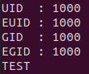

# Rendu "Les droits d’accès dans les systèmes UNIX"

## Binome

- Rayane Hamani - rayane.hamani.etu@univ-lille.fr
- Florian Dendoncker - florian.dendoncker.etu@univ-lille.fr

## Question 1

Le processus ne peut pas ouvrir le fichier car, bien que faisant parti du groupe ubuntu, toto reste le propriétaire du fichier et n'a pas les droits d'écriture sur dessus.

```sh
sudo adduser toto
sudo usermod -g ubuntu toto
su toto
cd /home/toto
touch titi.txt
chmod -777 titi.txt
chmod +464 titi.txt
echo "Hello World !" > titi.txt
```


## Question 2

Le bit d'exécution pour un répertoire indique le droit d'entrer dans ce répertoire et d'accéder à ses fichiers.

```sh
su ubuntu
cd /home/ubuntu
mkdir mydir
chmod -777 mydir
chmod +767 mydir
su toto
cd mydir
```


Une fois les droits d'exécution retirés, toto n'a plus accès au dossier ni à ses fichiers.

```sh
su ubuntu
cd /home/ubuntu
touch mydir/data.txt
su toto
ls -al mydir
```


Il nous est possible de lister le contenu du dossier (car nous avons gardé les droits de lecture) mais l'accès aux métadonnées nous est refusé (car nous n'avons pas les droits d'exécution). De ce fait, avec l'option -l de ls, toutes les métadonnées sont remplacées par des ?.

## Question 3

Lorsqu'exécuté avec l'utilisateur ubuntu, ce resultat s'affiche :



Lorsqu'exécuté avec l'utilisateur toto, ce resultat s'affiche :


Lorsqu'exécuté avec l'utilisateur toto, une fois le flag set-user-id activé, ce resultat s'affiche :


Le flag set-user-id permet donc à toto d'accéder au fichier même sans en avoir les droits.

## Question 4

Les valeurs EUID et EGID ne semblent pas changer lorsqu'on lance le script avec le flag set-user-id activé. Cela est dû au fait qu'en lançant le script via la commande python3, les autorisations sont décidées au lancement de cette commande, rendant l'activation du flag sur le fichier inutile.

Un utilisateur pourrait changer le contenu du fichier passwd sans demander a l'administrateur si un script ayant le flag set-user-id activé permettant d'y accéder était disponible.

## Question 5


La commande chfm permet de changer le nom et les informations d'un utilisateur.


On voit dans ce screenshot des permissions du script chfn que le flag set-user-id est activé, permettant à tous les utilisateurs d'utiliser ce script tout en gardant une méthode d'identification de l'utilisateur.

Une fois le script executé, on remarque bel et bien les changements dans le fichier passwd.


Le flag set-user-id a donc permis à toto de lancer le script mais ses véritables identifiants ont été récupérés par le script afin de savoir de quel utilisateur il faut changer les informations.

## Question 6

Les mots de passes utilisateurs sont stockés dans le fichier /etc/shadow.

La raison de la séparation des informations de comptes en deux fichiers est sûrement due au fait que le fichier shadow est, contrairement au fichier passwd, crypté pour des raisons de sécurité.

## Question 7

**Scripts bash dans le repertoire *question7*.**

Le sticky bit est la tricky part entre les consignes `peuvent modifier tous les fichiers [...] et répertoires dans dir_a` et `n'ont pas le droit d'effacer [...] qui ne leur appartiennent pas`.

## Question 8

Le programme et les scripts dans le repertoire *question8*.

Le script a été réalisé en python et non en C car la lecture ligne par ligne et l'extraction de données du fichier passwd prenait trop de temps à être mis en place.

## Question 9

Le programme et les scripts dans le repertoire *question9*.

## Question 10

Les programmes *groupe_server* et *groupe_client* dans le repertoire
*question10* ainsi que les tests.